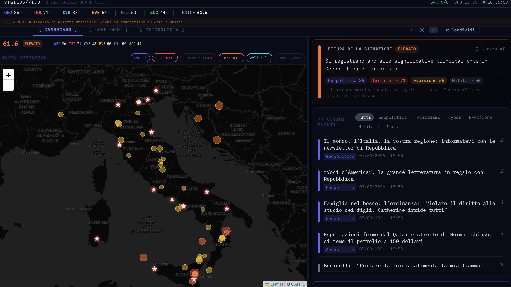

<p align="center">
  
</p>

<h1 align="center">VIGILUS — Italy Crisis Board</h1>

<p align="center">
  <em>Real-time OSINT intelligence dashboard for Italy's national security</em>
</p>

<p align="center">
  <a href="https://vigilus-frontend.onrender.com"></a>
</p>

<p align="center">
  
  
  
  
  
  
</p>

[🇮🇹 Italiano](#italiano) · [🇬🇧 English](#english)

<p align="center">
  
</p>

---

<a id="italiano"></a>

## 🇮🇹 Italiano

Dashboard OSINT open source per il monitoraggio della situazione di sicurezza nazionale italiana, basata esclusivamente su dati pubblici.

> **NON è un livello di allerta ufficiale.** Aggrega anomalie statistiche su proxy pubblici. In caso di emergenza seguire le autorità competenti (112, Protezione Civile).

---

### Stack

| Layer | Tecnologie |
|---|---|
| Backend | Python 3.12, FastAPI, SQLAlchemy 2.0, APScheduler, spaCy, Alembic |
| Frontend | React 18, Vite, Recharts, Leaflet, Tailwind CSS, Transformers.js |
| Database | SQLite (dev) / PostgreSQL 16 (prod) |
| Infra | Docker Compose, GitHub Actions CI/CD |
| Sicurezza | API key auth, rate limiting, CORS configurabile |
| Intelligence | ML browser-side (sentiment + threat), Headline Memory RAG (IndexedDB) |
| Licenza | AGPL-3.0 |

---

### Funzionalità

#### Dashboard principale
- **Score composito 0–100** — media pesata di 6 dimensioni (geopolitica, terrorismo, cyber, eversione, militare, sociale)
- **Radar plot** — visualizzazione a 6 assi delle dimensioni
- **Heatmap 7gg** — matrice temporale dell'andamento score
- **News ticker** — titoli scrollanti da 50+ feed RSS italiani in tempo reale
- **Trending keywords** — spike detection con z-score (rolling 2h vs baseline 7gg)
- **Anomalie z-score** — proxy che superano 1.5σ dalla baseline

#### Intelligence (browser-side)
- **Headline Memory (RAG)** — indice semantico locale di 5.000 headline in IndexedDB, ricerca tipo "quando è stata l'ultima crisi Iran?"
- **ML Classifier** — threat detection + sentiment analysis in Web Worker, zero chiamate server
- **Keyword Monitor** — alert personalizzabili su parole chiave, persistenza localStorage

#### Mappa operativa
- **Eventi geo-taggati** — NER spaCy su notizie RSS, posizionati su mappa Leaflet dark
- **Data layer toggle** — 14 basi militari NATO/USA ★, 18 infrastrutture critiche (porti ⚓, aeroporti ✈, centrali ⚡, cavi sottomarini 🔵)
- **Breakdown regionale** — aggregazione Nord/Centro/Sud con intensità

#### Strumenti
- **⌘K Command palette** — ricerca fuzzy su comandi, dimensioni, fonti
- **Confronto periodi** — settimana/mese/trimestre con delta per dimensione
- **Export CSV/Report** — download dati storici e report strutturato
- **Condivisione** — bottoni Twitter, Telegram, WhatsApp
- **Narrativa AI** — sintesi Claude con context score + anomalie + CSIRT
- **WebSocket** — aggiornamenti real-time dello score

---

### Avvio rapido

#### Backend

```bash
cd backend
python -m venv .venv && source .venv/bin/activate
pip install -e ".[dev]"
python -m spacy download it_core_news_sm
uvicorn vigilus.main:app --reload
```

API su `http://localhost:8000` — docs su `http://localhost:8000/docs`

#### Frontend

```bash
cd frontend
npm install
npm run dev
```

UI su `http://localhost:3000`

#### Docker Compose

```bash
cp .env.example .env
docker compose up -d
```

#### Test

```bash
cd backend
python -m pytest tests/ -v --cov=vigilus   # 102 test
```

---

### Fonti dati (7 collector + 50 RSS)

| Fonte | Dati | Cache |
|---|---|---|
| **Mega RSS** (50+ feed) | ANSA, AGI, Adnkronos, Repubblica, Corriere, Sole24Ore, Difesa Online, Formiche, CSIRT, Red Hot Cyber, Reuters, BBC... | 15min |
| GDELT Project | Articoli internazionali, negatività | 1h |
| CSIRT Italia | Bollettini cyber, CVE, alert infrastrutture | 30min |
| Google Trends | Interesse pubblico su termini chiave | 24h |
| ACLED | Proteste e scontri geo-localizzati | 7gg |
| OpenSky Network | Voli militari su basi italiane (ADS-B) | 1h |
| ANSA RSS + NER | Notizie geo-taggate con spaCy | ogni ciclo |

---

### Score

Indice composito 0–100, media pesata di 6 dimensioni normalizzate via z-score vs baseline rolling 90 giorni:

| Dimensione | Peso | Fonti |
|---|---|---|
| Geopolitica | 25% | GDELT, militare |
| Terrorismo | 20% | GDELT, Google Trends |
| Cyber | 15% | CSIRT, GDELT |
| Eversione | 15% | GDELT, ACLED, RSS |
| Militare | 15% | ADS-B, GDELT, Trends |
| Sociale | 10% | GDELT, Trends, ACLED |

| Score | Livello |
|---|---|
| 0–20 | 🟢 CALMO |
| 21–40 | 🔵 NORMALE |
| 41–60 | 🟡 ATTENZIONE |
| 61–80 | 🟠 ELEVATO |
| 81–100 | 🔴 CRITICO |

---

### API (22 endpoint)

```
GET  /api/score/current              score + dimensioni + confidence
GET  /api/score/history              storico (?days=30)
GET  /api/score/anomalies            proxy con |z| >= 1.5σ
GET  /api/score/compare              confronto periodi (?period=week|month|quarter)
GET  /api/score/narrative            sintesi AI (Claude)
POST /api/score/trigger              forza ricalcolo
GET  /api/dimension/{name}           dettaglio dimensione
GET  /api/dimension/{name}/history   storico dimensione
GET  /api/events/latest              eventi classificati
GET  /api/headlines                  titoli per ticker (50+ fonti)
GET  /api/trending                   keywords con spike detection
GET  /api/map/events                 eventi geo-taggati NER
GET  /api/map/regional               breakdown Nord/Centro/Sud
GET  /api/layers/military            GeoJSON basi militari
GET  /api/layers/infrastructure      GeoJSON infrastrutture critiche
GET  /api/layers/all                 tutti i data layer
GET  /api/export/csv                 download CSV storico
GET  /api/export/report              report JSON strutturato
GET  /api/sources/status             stato fonti dati
GET  /api/cache/status               cache collector
GET  /api/methodology                documentazione pesi e dimensioni
GET  /health                         health check
WS   /ws/score                       aggiornamenti real-time
```

Auth: header `X-API-Key` quando `API_KEY` è configurato. Pubblici: `/health`, `/docs`, `/api/methodology`.

---

### Struttura repository

```
italy-security-board/
├── .github/workflows/ci.yml        CI: test, lint, build, Docker
├── backend/
│   ├── migrations/                  Alembic (async)
│   ├── vigilus/
│   │   ├── api/                     22 endpoint FastAPI
│   │   │   ├── score.py             score, history, anomalies, trigger
│   │   │   ├── compare.py           confronto periodi
│   │   │   ├── export.py            CSV + report
│   │   │   ├── headlines.py         titoli per ticker
│   │   │   ├── trending.py          spike detection keywords
│   │   │   ├── layers.py            data layer GeoJSON
│   │   │   ├── regional.py          breakdown regionale
│   │   │   └── ...                  dimensions, events, narrative, map, sources, cache, methodology, websocket
│   │   ├── collectors/              7 collector (GDELT, RSS, MegaRSS, CSIRT, Trends, ACLED, ADS-B)
│   │   ├── engine/                  score, dimensions, normalizer, baseline, trending
│   │   ├── middleware/              auth (API key) + rate limiting
│   │   ├── models/                  SQLAlchemy (ScoreSnapshot, DimensionScore, Event, SourceStatus)
│   │   └── scripts/                 seed_baseline.py
│   └── tests/                       102 test
├── frontend/src/
│   ├── components/                  22 componenti
│   │   ├── ScoreGauge.jsx           gauge circolare 0-100
│   │   ├── RadarPlot.jsx            radar 6 assi
│   │   ├── NewsTicker.jsx           ticker scrollante 50+ feed
│   │   ├── TrendingKeywords.jsx     spike keywords z-score
│   │   ├── MapView.jsx              mappa + data layer toggle
│   │   ├── HeadlineMemory.jsx       RAG search (IndexedDB)
│   │   ├── MLClassifier.jsx         threat + sentiment (Web Worker)
│   │   ├── KeywordMonitor.jsx       alert personalizzabili
│   │   ├── CommandPalette.jsx       ⌘K fuzzy search
│   │   ├── ComparisonView.jsx       confronto periodi
│   │   ├── ShareButtons.jsx         condivisione social
│   │   └── ...                      Timeline, Heatmap, Anomalies, DimensionCard/Modal, NarrativeBox, EventFeed, SourceStatus, RegionalBreakdown, ExportButtons, ErrorBoundary
│   ├── services/headlineMemory.js   IndexedDB RAG engine
│   ├── workers/ml-worker.js         Web Worker ML
│   ├── hooks/                       useScore, useWebSocket, useDimension
│   └── utils/                       colors, format
├── data/
│   ├── geojson/                     military_bases.json, infrastructure.json
│   └── seed/baseline_real.json      baseline 90gg
├── docker-compose.yml
├── .env.example
└── .env.production.example
```

---

### Deploy in produzione

1. Copia `.env.production.example` → `.env`
2. Genera API key: `python -c "import secrets; print(secrets.token_urlsafe(32))"`
3. `docker compose up -d`
4. `docker compose exec backend alembic upgrade head`
5. (Opzionale) `docker compose exec backend python -m vigilus.scripts.seed_baseline`

**Checklist:** `DEBUG=false` · `API_KEY` configurata · `CORS_ORIGINS` dominio reale · `RATE_LIMIT_PER_MINUTE=60` · PostgreSQL · HTTPS · Backup DB

---

### Limitazioni

- GDELT copre prevalentemente fonti in lingua inglese
- Google Trends: rate limit aggressivo (cache 24h)
- OpenSky free tier: ~100 richieste/giorno
- Baseline va rigenerata ogni 3 mesi
- Lo score riflette anomalie statistiche, non valutazioni di intelligence
- ML browser-side usa classificazione keyword-based (no modello ONNX pesante)

---

<a id="english"></a>

## 🇬🇧 English

Open source OSINT dashboard for monitoring Italy's national security situation, based exclusively on public data.

> **NOT an official alert level.** Aggregates statistical anomalies from public proxies. In case of emergency, follow competent authorities (112, Civil Protection).

---

### Stack

| Layer | Technologies |
|---|---|
| Backend | Python 3.12, FastAPI, SQLAlchemy 2.0, APScheduler, spaCy, Alembic |
| Frontend | React 18, Vite, Recharts, Leaflet, Tailwind CSS, Transformers.js |
| Database | SQLite (dev) / PostgreSQL 16 (prod) |
| Infra | Docker Compose, GitHub Actions CI/CD |
| Security | API key auth, rate limiting, configurable CORS |
| Intelligence | Browser-side ML (sentiment + threat), Headline Memory RAG (IndexedDB) |
| License | AGPL-3.0 |

---

### Features

#### Main Dashboard
- **Composite score 0–100** — weighted average of 6 dimensions (geopolitics, terrorism, cyber, subversion, military, social)
- **Radar plot** — 6-axis dimension visualization
- **7-day heatmap** — temporal score matrix
- **News ticker** — scrolling headlines from 50+ Italian RSS feeds in real-time
- **Trending keywords** — spike detection with z-score (2h rolling window vs 7-day baseline)
- **Z-score anomalies** — proxies exceeding 1.5σ from baseline

#### Intelligence (browser-side)
- **Headline Memory (RAG)** — local semantic index of 5,000 headlines in IndexedDB, search like "when was the last Iran crisis?"
- **ML Classifier** — threat detection + sentiment analysis in Web Worker, zero server calls
- **Keyword Monitor** — custom keyword alerts with localStorage persistence

#### Operational Map
- **Geo-tagged events** — spaCy NER on RSS articles, plotted on dark Leaflet map
- **Toggleable data layers** — 14 NATO/US military bases ★, 18 critical infrastructure (ports ⚓, airports ✈, power plants ⚡, submarine cables 🔵)
- **Regional breakdown** — North/Center/South aggregation with intensity

#### Tools
- **⌘K Command palette** — fuzzy search across commands, dimensions, sources
- **Period comparison** — week/month/quarter with per-dimension delta
- **CSV/Report export** — download historical data and structured report
- **Social sharing** — Twitter, Telegram, WhatsApp buttons
- **AI Narrative** — Claude synthesis with score context + anomalies + CSIRT
- **WebSocket** — real-time score updates

---

### Quick Start

#### Backend

```bash
cd backend
python -m venv .venv && source .venv/bin/activate
pip install -e ".[dev]"
python -m spacy download it_core_news_sm
uvicorn vigilus.main:app --reload
```

API at `http://localhost:8000` — docs at `http://localhost:8000/docs`

#### Frontend

```bash
cd frontend
npm install
npm run dev
```

UI at `http://localhost:3000`

#### Docker Compose

```bash
cp .env.example .env
docker compose up -d
```

#### Tests

```bash
cd backend
python -m pytest tests/ -v --cov=vigilus   # 102 tests
```

---

### Data Sources (7 collectors + 50 RSS feeds)

| Source | Data | Cache |
|---|---|---|
| **Mega RSS** (50+ feeds) | ANSA, AGI, Adnkronos, Repubblica, Corriere, Sole24Ore, Difesa Online, Formiche, CSIRT, Red Hot Cyber, Reuters, BBC... | 15min |
| GDELT Project | International articles, negativity ratios | 1h |
| CSIRT Italia | Cyber bulletins, CVEs, infrastructure alerts | 30min |
| Google Trends | Public interest on key terms | 24h |
| ACLED | Geo-located protests and clashes | 7d |
| OpenSky Network | Military flights over Italian bases (ADS-B) | 1h |
| ANSA RSS + NER | Geo-tagged news via spaCy | each cycle |

---

### Score

Composite index 0–100, weighted average of 6 z-score normalized dimensions vs 90-day rolling baseline:

| Dimension | Weight | Sources |
|---|---|---|
| Geopolitics | 25% | GDELT, military |
| Terrorism | 20% | GDELT, Google Trends |
| Cyber | 15% | CSIRT, GDELT |
| Subversion | 15% | GDELT, ACLED, RSS |
| Military | 15% | ADS-B, GDELT, Trends |
| Social | 10% | GDELT, Trends, ACLED |

| Score | Level |
|---|---|
| 0–20 | 🟢 CALM |
| 21–40 | 🔵 NORMAL |
| 41–60 | 🟡 ATTENTION |
| 61–80 | 🟠 ELEVATED |
| 81–100 | 🔴 CRITICAL |

---

### API (22 endpoints)

```
GET  /api/score/current              current score + dimensions + confidence
GET  /api/score/history              historical (?days=30)
GET  /api/score/anomalies            proxies with |z| >= 1.5σ
GET  /api/score/compare              period comparison (?period=week|month|quarter)
GET  /api/score/narrative            AI synthesis (Claude)
POST /api/score/trigger              force recalculation
GET  /api/dimension/{name}           dimension detail
GET  /api/dimension/{name}/history   dimension history
GET  /api/events/latest              classified events
GET  /api/headlines                  ticker headlines (50+ sources)
GET  /api/trending                   keywords with spike detection
GET  /api/map/events                 NER geo-tagged events
GET  /api/map/regional               North/Center/South breakdown
GET  /api/layers/military            military bases GeoJSON
GET  /api/layers/infrastructure      critical infrastructure GeoJSON
GET  /api/layers/all                 all data layers
GET  /api/export/csv                 CSV historical download
GET  /api/export/report              structured JSON report
GET  /api/sources/status             data source health
GET  /api/cache/status               collector cache
GET  /api/methodology                dimension weights documentation
GET  /health                         health check
WS   /ws/score                       real-time updates
```

Auth: `X-API-Key` header when `API_KEY` is set. Public: `/health`, `/docs`, `/api/methodology`.

---

### Production Deployment

1. Copy `.env.production.example` → `.env`
2. Generate API key: `python -c "import secrets; print(secrets.token_urlsafe(32))"`
3. `docker compose up -d`
4. `docker compose exec backend alembic upgrade head`
5. (Optional) `docker compose exec backend python -m vigilus.scripts.seed_baseline`

**Checklist:** `DEBUG=false` · `API_KEY` set · `CORS_ORIGINS` with real domain · `RATE_LIMIT_PER_MINUTE=60` · PostgreSQL · HTTPS · DB backups

---

### Limitations

- GDELT primarily covers English-language sources
- Google Trends: aggressive rate limiting (24h cache)
- OpenSky free tier: ~100 requests/day
- Baseline should be regenerated every 3 months
- Score reflects statistical anomalies, not intelligence assessments
- Browser-side ML uses keyword-based classification (no heavy ONNX model)
